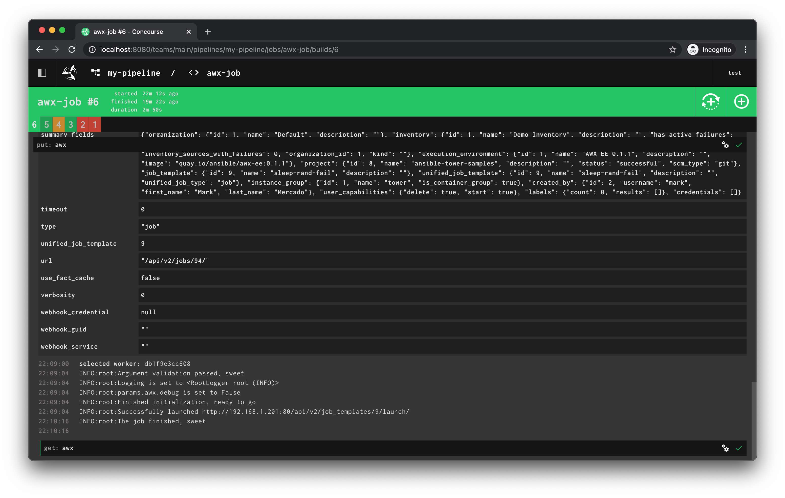

# Concourse AWX Resource

A [Concource CI](https://concourse-ci.org/) custom resource for [Ansible AWX](https://github.com/ansible/awx).
Docker images are named `quay.io/mamercad/concourse-awx-resource:latest` and can be viewed [here](https://quay.io/repository/mamercad/concourse-awx-resource), the [Dockerfile](Dockerfile) is in the root of this repository.

Currently, the resource supports launching [AWX Job Templates](https://docs.ansible.com/ansible-tower/latest/html/userguide/job_templates.html) and [Workflow Job Templates](https://docs.ansible.com/ansible-tower/latest/html/userguide/workflow_templates.html).

## Resource Configuration

`awx.endpoint`: The API endpoint of the AWX instance. Follows the same pattern as the AWX API or CLI, e.g., `https://your.tower.tld`. Note the lack of the trailing lash, and, don't provide `/api/v2`.

`awx.auth`: The authentication context, both `Bearer <oauth_token>` and `Basic <base64_user_colon_pass>` should work.

## Resource Behavior

`check`: No-op.

`in`: No-op.

`out`: Launches either the job template or the workflow job template, polling it until completion.

### Parameters

`awx.type`: (Required) Currently supports either `job_templates` and `workflow_job_templates`. The name is plural, but, the behavior is singular (keeping parity with the API terminology).

`awx.id`: (Required) The ID of the job template or workflow job template to launch.

`awx.debug`: (Optional, default is `false`) Controls whether or not to enable additional debugging information.

## Example Pipeline

```yaml
resource_types:
  - name: awx-workflow-resource
    type: docker-image
    source:
      repository: quay.io/mamercad/concourse-awx-resource

resources:
  - name: awx
    type: awx-workflow-resource
    source:
      awx:
        endpoint: ((TOWER_HOST))
        auth: Bearer ((TOWER_OAUTH_TOKEN))

jobs:
  - name: awx-job
    plan:
      - put: awx
        params:
          awx:
            type: job_templates
            id: ((TOWER_JOB_TEMPLATES))
            debug: false
      - put: awx
        params:
          awx:
            type: workflow_job_templates
            id: ((TOWER_WORKFLOW_JOB_TEMPLATES))
            debug: false
```

## Screenshot

All of the job results will be returned, here's a screenshot to give you a feel:


## License

[MIT](LICENSE) © Mark Mercado <<mamercad@gmail.com>>
